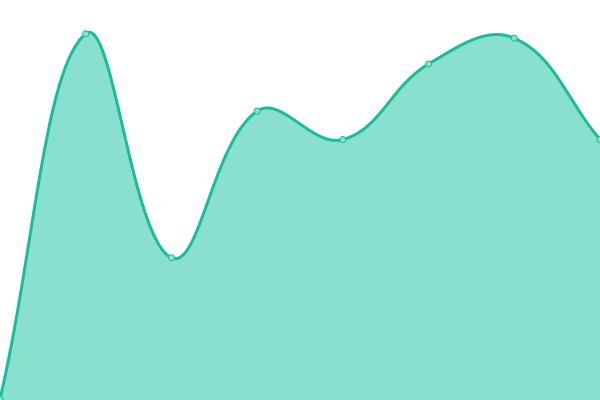
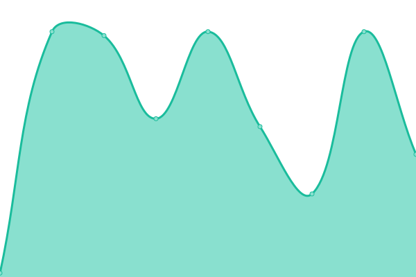
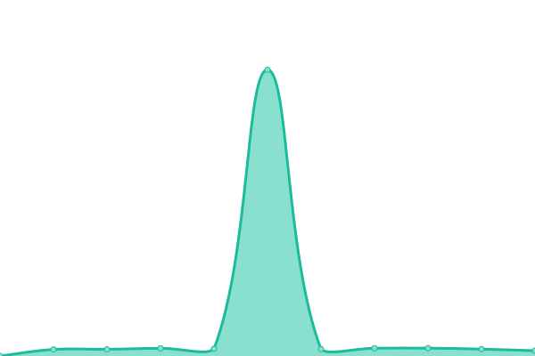
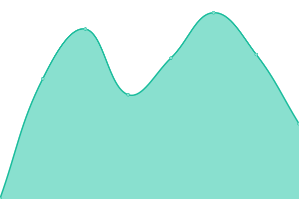

# [📈 Live Status](https://status.tensegrity-labs.com): <!--live status--> **🟧 Partial outage**

This repository contains the open-source uptime monitor and status page for [Tensegrity Labs Admin](https://www.tensegrity-labs.com), powered by [Upptime](https://github.com/upptime/upptime).

With [Upptime](https://upptime.js.org), you can get your own unlimited and free uptime monitor and status page, powered entirely by a GitHub repository. We use [Issues](https://github.com/tensegrity-labs-admin/uptime/issues) as incident reports, [Actions](https://github.com/tensegrity-labs-admin/uptime/actions) as uptime monitors, and [Pages](https://status.tensegrity-labs.com) for the status page.

<!--start: status pages-->
<!-- This summary is generated by Upptime (https://github.com/upptime/upptime) -->
<!-- Do not edit this manually, your changes will be overwritten -->
<!-- prettier-ignore -->
| URL | Status | History | Response Time | Uptime |
| --- | ------ | ------- | ------------- | ------ |
|  [Website (www.tensegrity-labs.com)](https://www.tensegrity-labs.com) | 🟩 Up | [website-www-tensegrity-labs-com.yml](https://github.com/tensegrity-labs-admin/uptime/commits/HEAD/history/website-www-tensegrity-labs-com.yml) | 

 371ms
     
 | 

<a href="https://status.tensegrity-labs.com/history/website-www-tensegrity-labs-com">100.00%</a>
    

|  [URL Shortner (tlabs.link)](https://tlabs.link/test) | 🟩 Up | [url-shortner-tlabs-link.yml](https://github.com/tensegrity-labs-admin/uptime/commits/HEAD/history/url-shortner-tlabs-link.yml) | 

 326ms
     
 | 

<a href="https://status.tensegrity-labs.com/history/url-shortner-tlabs-link">99.63%</a>
    

|  [In-house Server](xen-srv.tensegrity-labs.com) | 🟩 Up | [in-house-server.yml](https://github.com/tensegrity-labs-admin/uptime/commits/HEAD/history/in-house-server.yml) | 

 44ms
     
 | 

<a href="https://status.tensegrity-labs.com/history/in-house-server">100.00%</a>
    

|  [Cloud Services (tcloud.dev)](https://tcloud.dev) | 🟩 Up | [cloud-services-tcloud-dev.yml](https://github.com/tensegrity-labs-admin/uptime/commits/HEAD/history/cloud-services-tcloud-dev.yml) | 

 558ms
     
 | 

<a href="https://status.tensegrity-labs.com/history/cloud-services-tcloud-dev">99.56%</a>
    

|  [Cloud Services (Onlyoffice)](https://onlyoffice.tcloud.dev) | 🟥 Down | [cloud-services-onlyoffice.yml](https://github.com/tensegrity-labs-admin/uptime/commits/HEAD/history/cloud-services-onlyoffice.yml) | 

 3400ms
     
 | 

<a href="https://status.tensegrity-labs.com/history/cloud-services-onlyoffice">0.00%</a>
    

|  [GitLab (gitlab.tcloud.dev)](https://gitlab.tcloud.dev) | 🟩 Up | [git-lab-gitlab-tcloud-dev.yml](https://github.com/tensegrity-labs-admin/uptime/commits/HEAD/history/git-lab-gitlab-tcloud-dev.yml) | 

 518ms
     
 | 

<a href="https://status.tensegrity-labs.com/history/git-lab-gitlab-tcloud-dev">100.00%</a>
    

|  [Cloud Storage (minio.tcloud.dev)](https://minio.tcloud.dev) | 🟩 Up | [cloud-storage-minio-tcloud-dev.yml](https://github.com/tensegrity-labs-admin/uptime/commits/HEAD/history/cloud-storage-minio-tcloud-dev.yml) | 

 315ms
     
 | 

<a href="https://status.tensegrity-labs.com/history/cloud-storage-minio-tcloud-dev">100.00%</a>
    

|  [Cloud Storage API (minio-api.tcloud.dev)](https://minio-api.tcloud.dev/minio/health/live) | 🟩 Up | [cloud-storage-api-minio-api-tcloud-dev.yml](https://github.com/tensegrity-labs-admin/uptime/commits/HEAD/history/cloud-storage-api-minio-api-tcloud-dev.yml) | 

 300ms
     
 | 

<a href="https://status.tensegrity-labs.com/history/cloud-storage-api-minio-api-tcloud-dev">99.48%</a>
    

<!--end: status pages-->

[**Visit our status website →**](https://status.tensegrity-labs.com)

## 📄 License

- Powered by: [Upptime](https://github.com/upptime/upptime)
- Code: [MIT](./LICENSE) © [Tensegrity Labs Admin](https://www.tensegrity-labs.com)
- Data in the `./history` directory: [Open Database License](https://opendatacommons.org/licenses/odbl/1-0/)
